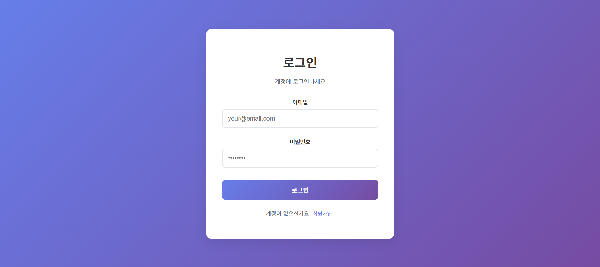
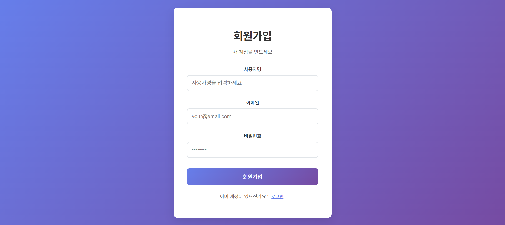

## 🔗 시리즈 연결

이 포스트는 JWT 인증 시스템 시리즈의 **Part 3**입니다.

- **[Part 1: 기본 JWT 인증 시스템 구축하기](https://hoondongseo.github.io/posts/simple_auth_system_1/)**
- **[Part 2: 고급 JWT 인증 기능](https://hoondongseo.github.io/posts/simple_auth_system_2/)**
- **Part 3**: React 프론트엔드 구현 ← 현재 글

## 🤔 드디어 프론트엔드 차례!

Part 1, 2에서 완성한 백엔드 JWT 인증 시스템... 이제 완벽하게 작동하는데 한 가지 문제가 있어요.

**"사용자가 이걸 어떻게 사용하죠? 😅"**

지금까지는 Thunder Client로 API를 테스트했지만, 일반 사용자들이 터미널에서 `curl`을 칠 수는 없잖아요! 

이번 Part 3에서는 React를 사용해서 **실제 웹사이트처럼 예쁜 로그인 화면**을 만들어보겠습니다! 🎨

### 🎯 구현할 기능들

- ✅ React 프로젝트 설정 🏗️
- ✅ 로그인/회원가입 폼 컴포넌트 📝
- ✅ Context API를 활용한 전역 상태 관리 🗃️
- ✅ Axios를 이용한 API 통신 🌐
- ✅ 모던하고 깔끔한 UI/UX ✨

## 🏗️ Step 1: React 프로젝트 설정

먼저 Create React App으로 프론트엔드 프로젝트를 생성해보겠습니다! 🎉

```bash
npx create-react-app frontend
cd frontend
npm install axios
```

### 📁 프로젝트 구조

```text
frontend/
├── src/
│   ├── components/
│   │   ├── Auth/
│   │   │   ├── LoginForm.jsx
│   │   │   ├── RegisterForm.jsx
│   │   │   └── Auth.css
│   │   ├── context/
│   │   │   └── AuthContext.jsx
│   │   └── services/
│   │       └── api.js
│   ├── App.js
│   └── index.js
└── package.json
```

## 🌐 Step 2: API 통신 설정

백엔드와의 통신을 위한 Axios 설정을 먼저 해보겠습니다! 🔗

**`src/components/services/api.js`**

```javascript
import axios from 'axios';

const api = axios.create({
    baseURL: 'http://localhost:5000/api',
    headers: { 'Content-Type': 'application/json' },
});

// 요청 인터셉터로 Authorization 헤더 자동 추가
api.interceptors.request.use(config => {
    const token = localStorage.getItem('accessToken');
    if (token) config.headers.Authorization = `Bearer ${token}`;
    return config;
});

export default api;
```

**💡 핵심 포인트:**

- 🎯 `baseURL`로 백엔드 서버 주소 설정
- 🔐 요청 인터셉터로 모든 요청에 JWT 토큰 자동 추가
- 💾 localStorage에서 토큰을 가져와 Authorization 헤더에 포함

## 🗃️ Step 3: 전역 상태 관리 - AuthContext

React Context API를 사용해 인증 상태를 전역으로 관리하겠습니다!

**`src/components/context/AuthContext.jsx`**

```jsx
import React, { createContext, useState, useEffect } from 'react';
import api from '../services/api';

export const AuthContext = createContext();

export const AuthProvider = ({ children }) => {
    const [user, setUser] = useState(null);

    // 앱 시작할 때 저장된 토큰으로 사용자 정보 불러오기
    useEffect(() => {
        const token = localStorage.getItem('accessToken');
        if (!token) return;
        
        api.get('/auth/me')
            .then(res => setUser(res.data.user))
            .catch(() => {
                localStorage.removeItem('accessToken');
                setUser(null);
            });
    }, []);

    // 로그인 함수
    const login = async (email, password) => {
        const res = await api.post('/auth/login', { email, password });
        const { accessToken, data: { user } } = res.data;
        
        localStorage.setItem('accessToken', accessToken);
        setUser(user);
        return res;
    };

    // 로그아웃 함수
    const logout = async () => {
        await api.post('/auth/logout'); // 서버에 로그아웃 알리기
        localStorage.removeItem('accessToken');
        setUser(null);
    };

    return (
        <AuthContext.Provider value={{ user, login, logout }}>
            {children}
        </AuthContext.Provider>
    );
};
```

**🔧 핵심 기능:**

- 📊 `useState`로 사용자 정보 상태 관리
- 🔄 `useEffect`로 페이지 새로고침 시 토큰 확인 및 사용자 정보 복원
- 🚪 `login`, `logout` 함수로 인증 상태 변경

## 📝 Step 4: 로그인 폼 컴포넌트

사용자가 로그인할 수 있는 예쁜 폼을 만들어보겠습니다!

**`src/components/Auth/LoginForm.jsx`**

```jsx
import React, { useState, useContext } from "react";
import { AuthContext } from "../context/AuthContext";
import "./Auth.css";

const LoginForm = ({ onSwitchToRegister }) => {
	const [formData, setFormData] = useState({
		email: "",
		password: "",
	});
	const [loading, setLoading] = useState(false);
	const [error, setError] = useState("");

	const { login } = useContext(AuthContext);

	const handleChange = (e) => {
		setFormData({
			...formData,
			[e.target.name]: e.target.value,
		});
		if (error) setError(""); // 입력 시 에러 메시지 초기화
	};

	const handleSubmit = async (e) => {
		e.preventDefault();
		setLoading(true);
		setError("");

		try {
			await login(formData.email, formData.password);
		} catch (err) {
			setError(err.response?.data?.message || "로그인에 실패했습니다.");
		} finally {
			setLoading(false);
		}
	};

	return (
		<div className="auth-container">
			<div className="auth-card">
				<h1 className="auth-title">로그인</h1>
				<p className="auth-subtitle">계정에 로그인하세요</p>

				{error && <div className="error-message">{error}</div>}

				<form onSubmit={handleSubmit} className="auth-form">
					<div className="input-group">
						<label htmlFor="email">이메일</label>
						<input
							type="email"
							id="email"
							name="email"
							value={formData.email}
							onChange={handleChange}
							required
							placeholder="your@email.com"
						/>
					</div>

					<div className="input-group">
						<label htmlFor="password">비밀번호</label>
						<input
							type="password"
							id="password"
							name="password"
							value={formData.password}
							onChange={handleChange}
							required
							placeholder="••••••••"
						/>
					</div>

					<button
						type="submit"
						className="auth-button"
						disabled={loading}
					>
						{loading ? "로그인 중..." : "로그인"}
					</button>
				</form>

				<p className="auth-switch">
					계정이 없으신가요?{" "}
					<button
						type="button"
						className="switch-button"
						onClick={onSwitchToRegister}
					>
						회원가입
					</button>
				</p>
			</div>
		</div>
	);
};

export default LoginForm;
```

## 👤 Step 5: 회원가입 폼 컴포넌트

회원가입 기능을 위한 폼도 만들어보겠습니다!

**`src/components/Auth/RegisterForm.jsx`**

```jsx
import React, { useState } from "react";
import api from "../services/api";
import "./Auth.css";

const RegisterForm = ({ onSwitchToLogin }) => {
	const [formData, setFormData] = useState({
		username: "",
		email: "",
		password: "",
	});
	const [loading, setLoading] = useState(false);
	const [error, setError] = useState("");
	const [success, setSuccess] = useState("");

	const handleChange = (e) => {
		setFormData({
			...formData,
			[e.target.name]: e.target.value,
		});
		if (error) setError("");
		if (success) setSuccess("");
	};

	const handleSubmit = async (e) => {
		e.preventDefault();
		setLoading(true);
		setError("");
		setSuccess("");

		try {
			await api.post("/auth/register", formData);
			setSuccess("회원가입이 완료되었습니다! 로그인해주세요.");
			setTimeout(() => {
				onSwitchToLogin();
			}, 2000);
		} catch (err) {
			setError(err.response?.data?.message || "회원가입에 실패했습니다.");
		} finally {
			setLoading(false);
		}
	};

	return (
		<div className="auth-container">
			<div className="auth-card">
				<h1 className="auth-title">회원가입</h1>
				<p className="auth-subtitle">새 계정을 만드세요</p>

				{error && <div className="error-message">{error}</div>}
				{success && <div className="success-message">{success}</div>}

				<form onSubmit={handleSubmit} className="auth-form">
					<div className="input-group">
						<label htmlFor="username">사용자명</label>
						<input
							type="text"
							id="username"
							name="username"
							value={formData.username}
							onChange={handleChange}
							required
							placeholder="사용자명을 입력하세요"
						/>
					</div>

					<div className="input-group">
						<label htmlFor="email">이메일</label>
						<input
							type="email"
							id="email"
							name="email"
							value={formData.email}
							onChange={handleChange}
							required
							placeholder="your@email.com"
						/>
					</div>

					<div className="input-group">
						<label htmlFor="password">비밀번호</label>
						<input
							type="password"
							id="password"
							name="password"
							value={formData.password}
							onChange={handleChange}
							required
							placeholder="••••••••"
							minLength={6}
						/>
					</div>

					<button
						type="submit"
						className="auth-button"
						disabled={loading}
					>
						{loading ? "가입 중..." : "회원가입"}
					</button>
				</form>

				<p className="auth-switch">
					이미 계정이 있으신가요?{" "}
					<button
						type="button"
						className="switch-button"
						onClick={onSwitchToLogin}
					>
						로그인
					</button>
				</p>
			</div>
		</div>
	);
};

export default RegisterForm;
```

## 🎨 Step 6: 스타일링

모던하고 깔끔한 디자인을 위한 CSS를 작성하겠습니다!

**`src/components/Auth/Auth.css`**

```css
.auth-container {
	display: flex;
	justify-content: center;
	align-items: center;
	min-height: 100vh;
	background: linear-gradient(135deg, #667eea 0%, #764ba2 100%);
}

.auth-card {
	background: white;
	padding: 2.5rem;
	border-radius: 12px;
	box-shadow: 0 10px 30px rgba(0, 0, 0, 0.1);
	width: 100%;
	max-width: 400px;
	margin: 1rem;
}

.auth-title {
	text-align: center;
	margin-bottom: 0.5rem;
	color: #333;
	font-size: 2rem;
	font-weight: 600;
}

.auth-subtitle {
	text-align: center;
	margin-bottom: 2rem;
	color: #666;
	font-size: 0.95rem;
}

.auth-form {
	display: flex;
	flex-direction: column;
	gap: 1.5rem;
}

.input-group {
	display: flex;
	flex-direction: column;
	gap: 0.5rem;
}

.input-group label {
	font-weight: 500;
	color: #333;
	font-size: 0.9rem;
}

.input-group input {
	padding: 0.85rem;
	border: 2px solid #e1e5e9;
	border-radius: 8px;
	font-size: 1rem;
	transition: all 0.2s ease;
}

.input-group input:focus {
	outline: none;
	border-color: #667eea;
	box-shadow: 0 0 0 3px rgba(102, 126, 234, 0.1);
}

.auth-button {
	width: 100%;
	padding: 0.85rem;
	background: linear-gradient(135deg, #667eea 0%, #764ba2 100%);
	color: white;
	border: none;
	border-radius: 8px;
	font-size: 1rem;
	font-weight: 600;
	cursor: pointer;
	transition: all 0.2s ease;
	margin-top: 0.5rem;
}

.auth-button:hover:not(:disabled) {
	transform: translateY(-1px);
	box-shadow: 0 5px 15px rgba(102, 126, 234, 0.3);
}

.auth-button:disabled {
	opacity: 0.7;
	cursor: not-allowed;
	transform: none;
}

.auth-switch {
	text-align: center;
	margin-top: 1.5rem;
	color: #666;
	font-size: 0.9rem;
}

.switch-button {
	background: none;
	border: none;
	color: #667eea;
	cursor: pointer;
	text-decoration: underline;
	font-weight: 500;
}

.switch-button:hover {
	color: #764ba2;
}

.error-message {
	background: #fee;
	color: #c33;
	padding: 0.75rem;
	border-radius: 6px;
	border: 1px solid #fcc;
	margin-bottom: 1rem;
	font-size: 0.9rem;
}

.success-message {
	background: #efe;
	color: #363;
	padding: 0.75rem;
	border-radius: 6px;
	border: 1px solid #cfc;
	margin-bottom: 1rem;
	font-size: 0.9rem;
}
```

## 🏠 Step 7: 메인 App 컴포넌트

로그인과 회원가입 폼을 전환할 수 있는 메인 컴포넌트를 만듭니다!

**`src/App.js`**

```jsx
import React, { useState } from "react";
import LoginForm from "./components/Auth/LoginForm";
import RegisterForm from "./components/Auth/RegisterForm";
import "./App.css";

function App() {
	const [currentView, setCurrentView] = useState("login");

	return (
		<div className="App">
			{currentView === "login" ? (
				<LoginForm
					onSwitchToRegister={() => setCurrentView("register")}
				/>
			) : (
				<RegisterForm onSwitchToLogin={() => setCurrentView("login")} />
			)}
		</div>
	);
}

export default App;
```

## 🔌 Step 8: AuthProvider 연결

전역 상태 관리를 위해 AuthProvider를 연결합니다!

**`src/index.js`**

```jsx
import React from "react";
import ReactDOM from "react-dom/client";
import "./index.css";
import App from "./App";
import { AuthProvider } from "./components/context/AuthContext";

const root = ReactDOM.createRoot(document.getElementById("root"));
root.render(
	<React.StrictMode>
		<AuthProvider>
			<App />
		</AuthProvider>
	</React.StrictMode>
);
```

## 🚀 Step 9: 실행 및 테스트

이제 드디어 우리가 만든 프론트엔드를 실행해볼 시간입니다! 🎉

### 🔧 백엔드 서버 실행

```bash
# backend 폴더에서
npm run dev
```

### ⚛️ 프론트엔드 서버 실행

```bash
# frontend 폴더에서
npm start
```

### ✅ 실행 결과





### 🧪 테스트 시나리오

1. **회원가입 테스트** 📝
   - <http://localhost:3000> 접속
   - "회원가입" 클릭
   - 정보 입력 후 가입
   - 성공 메시지 확인

2. **로그인 테스트** 🔑
   - 가입한 계정으로 로그인
   - 네트워크 탭에서 JWT 토큰 확인
   - localStorage에 토큰 저장 확인

3. **에러 처리 테스트** ❌
   - 잘못된 정보로 로그인 시도
   - 에러 메시지 표시 확인

## 💡 핵심 포인트 정리

### 1. 컴포넌트 설계 🏗️

- **관심사의 분리**: 로그인/회원가입 폼을 별도 컴포넌트로 분리
- **재사용성**: 공통 CSS 클래스와 스타일 적용
- **상태 관리**: 각 폼의 로딩, 에러 상태 독립적 관리

### 2. 상태 관리 패턴 📊

- **Context API**: 전역 인증 상태 관리
- **로컬 스토리지**: 토큰 영속성 보장
- **자동 복원**: 페이지 새로고침 시 인증 상태 유지

### 3. API 통신 패턴 🌐

- **Axios 인터셉터**: 모든 요청에 토큰 자동 추가
- **에러 처리**: try-catch로 네트워크 에러 핸들링
- **사용자 피드백**: 로딩 상태와 에러 메시지 표시

### 4. UX 고려사항 ✨

- **로딩 상태**: 버튼 비활성화로 중복 요청 방지
- **실시간 피드백**: 입력 시 에러 메시지 자동 클리어
- **자동 전환**: 회원가입 성공 시 로그인 폼으로 이동

## 🎉 마무리

Part 3에서는 React를 사용해 JWT 인증 시스템의 프론트엔드를 완성했습니다! 🚀

Context API로 전역 상태를 관리하고, Axios로 백엔드와 통신하며, 모던한 UI/UX를 구현했어요.

### 🔮 다음 Part 4에서는

- 🎯 **대시보드 컴포넌트** 구현
- 🛡️ **보호된 라우트** (React Router)
- 🔄 **자동 토큰 갱신** 기능
- 📱 **반응형 디자인** 개선

현재까지의 코드는 [GitHub 리포지토리](https://github.com/hoondongseo/SimpleAuthSystem)에서 확인할 수 있습니다! 🔗

---

> 💡 **질문이나 피드백이 있으시면 댓글로 남겨주세요!** 😊  
> 다음 포스팅에서 더 고급 기능들을 다뤄보겠습니다! 🚀
